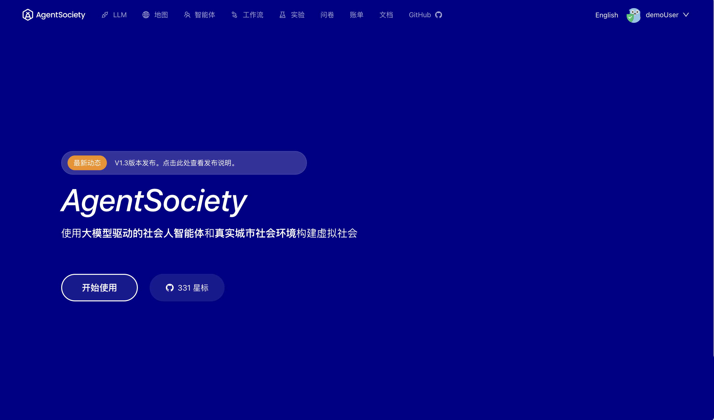

# Web 界面介绍

我们提供了两种访问 Web 界面的方式：通过我们的线上平台或本地部署服务。线上平台可通过 `https://agentsociety.fiblab.net` 访问，而本地部署的 UI 服务则默认在 `http://localhost:8080` 或您在配置文件中指定的地址上运行。

 

### 核心功能模块

无论是线上平台还是本地部署，都提供以下核心功能模块：

- **LLM**：配置模拟过程中使用的大语言模型 API 服务，为后续模拟仿真的智能体提供强大的语言理解和生成能力。
- **地图**：导入和管理模拟所需的地图数据。我们提供了多个城市的地图模板，您也可以通过 [MOSS](https://moss.fiblab.net/) 创建自定义地图。
- **智能体**：上传和管理智能体配置文件。我们提供了多个城市的智能体示例配置，用户还可以创建智能体模板，并基于社区中的智能实体构建自定义智能体。
- **工作流**：展示模拟过程中的动作序列和程序流程，帮助用户理解各组件间的交互机制和执行逻辑。
- **实验**：展示所有已完成的实验记录。点击具体实验可进入详细交互页面，用于查看和分析实验结果。

### 访问方式对比

##### 线上平台
- **优势**：无需本地部署，开箱即用，自动更新
- **要求**：需要注册账户
- **费用**：实验运行产生服务器使用费用，使用我们提供的 LLM API 服务需支付相应的调用费用
- **适用场景**：快速体验、小规模实验、无本地部署能力的用户

#### 本地部署
- **优势**：无账户系统限制，数据完全本地化，无额外费用
- **要求**：需要自行部署和维护服务
- **费用**：仅需承担自己的 API 调用费用
- **适用场景**：大规模实验、长期使用的用户

```{admonition} 选择建议
:class: tip
- 初次使用建议先体验线上平台，熟悉功能后再考虑本地部署
- 对于大规模或长期实验，推荐使用本地部署以降低成本
```