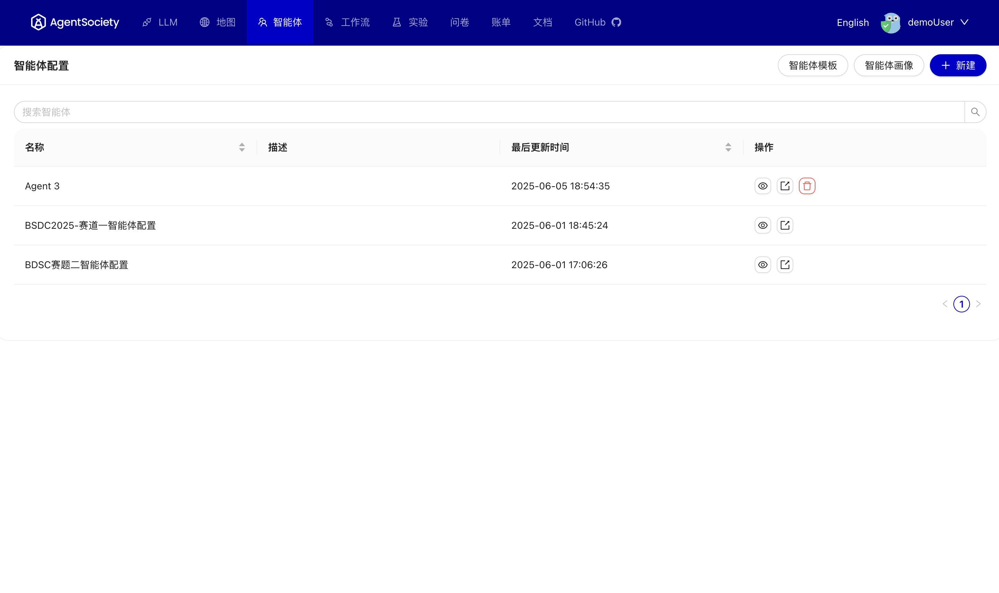
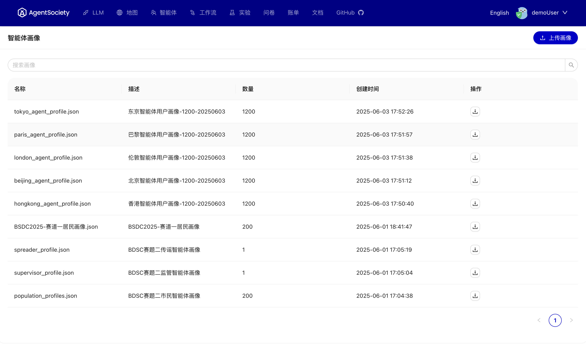
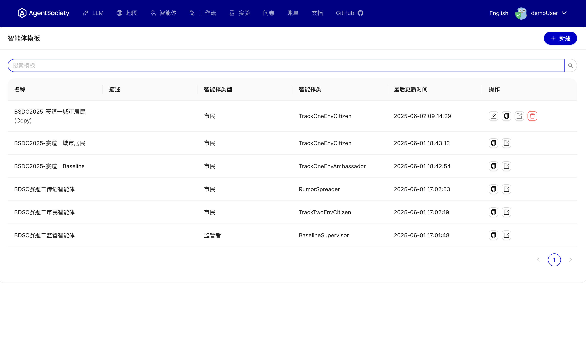
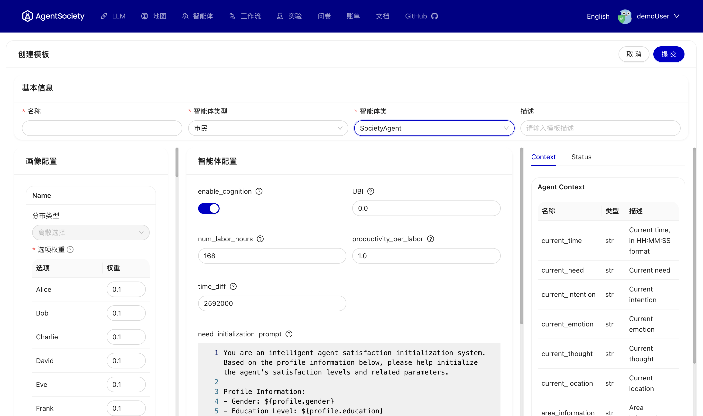
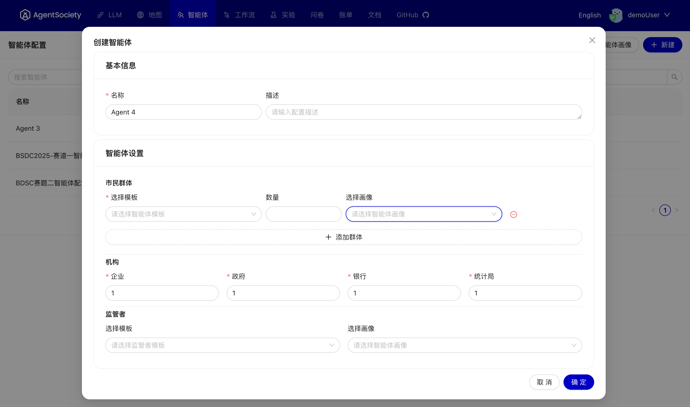

# 智能体

## 概述
本节提供了智能体功能的概述，包括如何上传配置文件和创建模板。用户可以基于这些元素构建完整的智能体配置。

 

## 上传配置文件
用户可以上传自己的配置文件，我们的在线平台也提供了几个城市的示例配置文件。如果您在本地部署，可以从在线平台下载配置文件。

 

## 创建模板
关于如何创建智能体模板的指南以及使用模板的好处。我们提供了多个模板示例供用户参考。

 

用户还可以创建自己的模板，这些模板可以通过社区共享。如果您在本地部署服务，需要使用 `pip install agentsociety-community` 安装社区包。

 

## 构建智能体
最后，用户可以使用上述提到的配置文件和模板创建完整的智能体配置。

 

