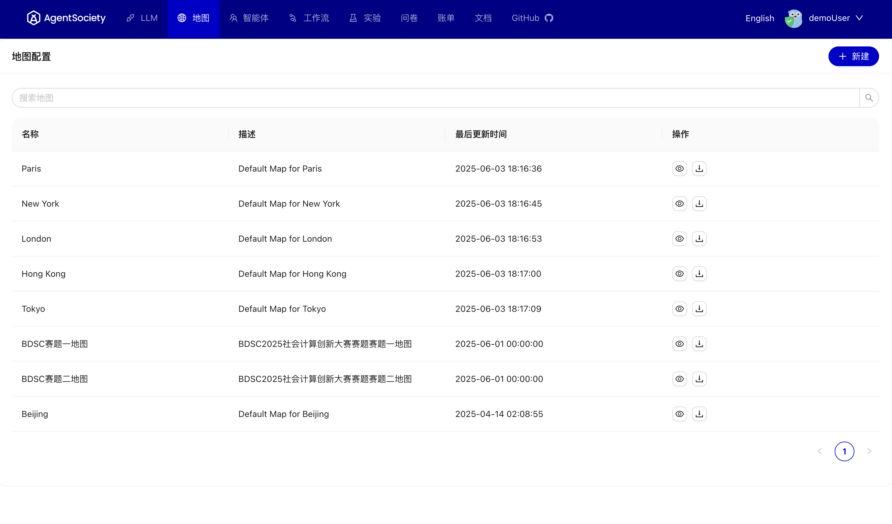

# 地图配置

## 概述
地图为智能体模拟提供空间环境支持。平台支持上传、下载和预览地图功能。

 

### 地图来源
- **线上平台**：提供多个城市的地图模板
- **本地部署**：可从线上平台下载地图模板使用
- **自定义地图**：通过 [MOSS](https://moss.fiblab.net/) 制作

### 主要功能
- 上传地图文件
- 下载地图模板  
- 预览地图内容