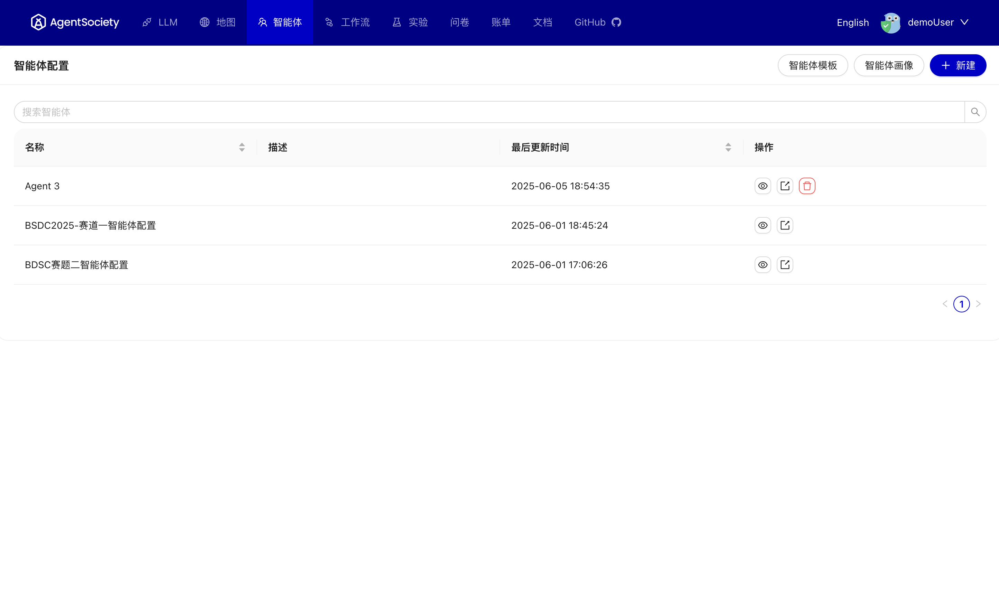
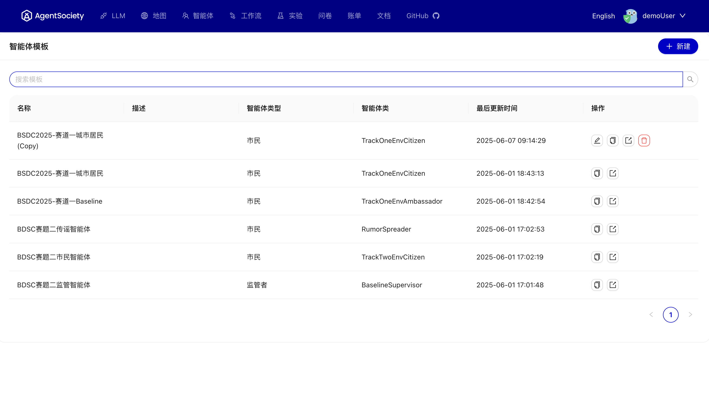
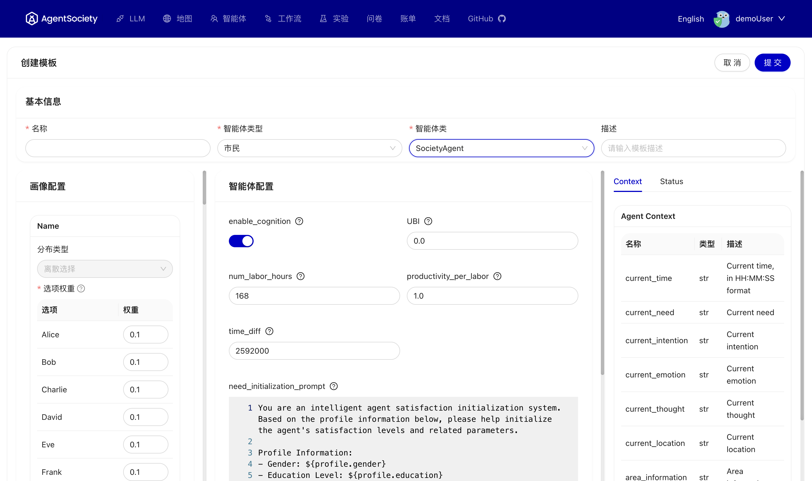

# 智能体配置

## 概述
智能体是AgentSociety平台的核心组件，承载着虚拟社会中各种角色的行为和交互逻辑。本节详细介绍智能体的配置管理功能，包括智能体画像文件的上传、模板的创建与使用，以及完整智能体配置的构建过程。

通过本节内容，您将掌握如何高效地管理和配置智能体，为仿真实验构建丰富多样的虚拟角色。

 

## 智能体画像文件管理
智能体画像文件定义了智能体的基本属性、行为特征和社会关系。您可以通过多种方式获取和管理画像文件：

- **上传自定义文件**：根据您的需求上传自己设计的智能体画像文件
- **使用示例文件**：我们的在线平台提供了多个城市的示例智能体画像文件供参考
- **本地部署支持**：如果您使用本地部署，可以从在线平台下载相应的智能体画像文件

 

## 智能体模板管理
智能体模板是预定义的配置框架，能够简化智能体创建过程并确保配置的一致性。使用模板的主要优势包括：

- **提高效率**：基于模板快速创建相似类型的智能体
- **保证一致性**：确保同类智能体具有相似的行为模式  
- **便于维护**：集中管理和更新智能体配置
- **促进复用**：模板可在多个配置中重复使用

 

### 自定义模板创建
您可以根据实际需求创建自定义智能体模板，这些模板支持通过社区平台共享和获取：

- **在线平台**：直接创建、编辑和共享模板
- **本地部署**：使用 `pip install agentsociety-community` 安装社区包以获取完整的模板支持

 

#### 模板创建步骤
创建智能体模板的详细流程如下：

1. **选择智能体类型**：首先需要选择智能体的类型，并基于智能体类型选择相应的智能体类
2. **配置画像属性**：如果选择的智能体类型为市民类型，左侧会显示市民画像的相关配置选项，如果选择监管者类型则没有该项
3. **查看可以使用的上下文参数**：右侧显示智能体的Context和Status内容，这些参数与profile的参数可在中间的prompt中使用，例如 `${profile.xxx}`，`${context.xxx}`，`${status.xxx}`
4. **配置智能体行为**：中间区域分为两部分：
   - **上半部分**：智能体配置，内容根据所选择的智能体类确定，包括各种配置项和prompt
   - **下半部分**：Block配置，可以为智能体赋予更多扩展功能

## 构建智能体配置
结合智能体画像文件和模板，您可以构建完整的智能体配置。整个创建流程包括：

1. **选择画像文件**：从已上传的画像文件中选择合适的智能体角色。如果不选择特定的智能体画像，系统将使用模板中的画像分布进行自动初始化
2. **应用模板**：选择相应的智能体模板作为配置基础
3. **保存配置**：保存智能体配置并用于后续的仿真实验中

 