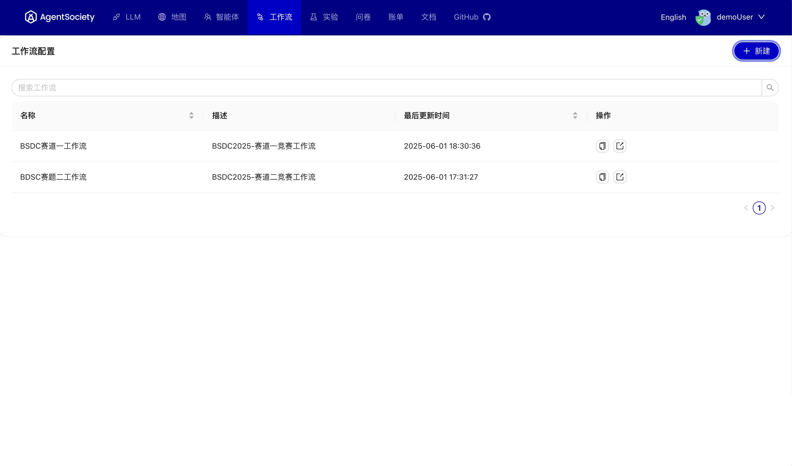
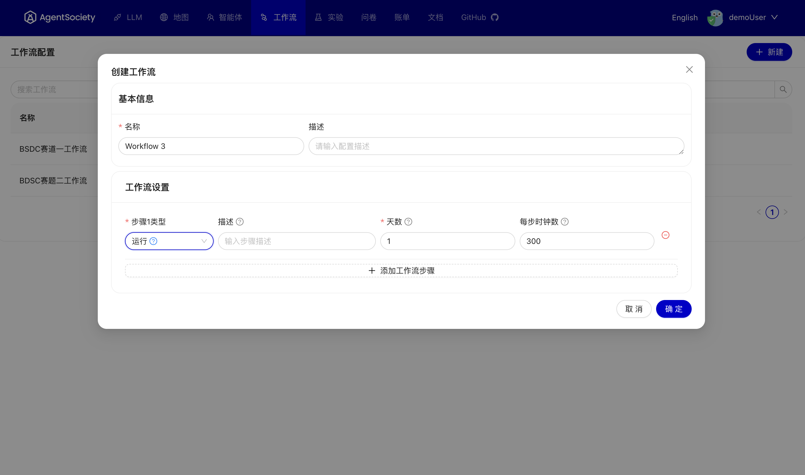

# 工作流管理

## 概述
工作流是AgentSociety平台中实验执行的核心框架，定义了仿真实验的完整流程和逻辑。通过工作流，您可以编排智能体的行为序列、设置实验条件、控制仿真进度，并收集实验数据。

 

## 工作流配置管理
工作流配置管理提供的功能包括：

- **查看工作流**：浏览已创建的工作流列表，查看工作流的基本信息和状态
- **编辑工作流**：修改现有工作流的配置和参数
- **复制工作流**：基于现有工作流快速创建相似的工作流配置
- **删除工作流**：移除不再需要的工作流配置
- **导出工作流**：将工作流配置导出为文件，便于备份和分享

## 创建新工作流
创建新的工作流是实验设计的重要环节。系统提供了直观的工作流构建界面，帮助您轻松设计复杂的仿真实验流程。

 

### 工作流创建步骤

1. **基础信息设置**：
   - 输入工作流名称和描述信息

2. **流程设计**：循环以下的流程
   - **添加步骤**：在合适的地方添加新的步骤
   - **选择步骤类型**：根据实验需求选择相应的步骤类型
   - **配置节点参数**：根据所选步骤类型填写相应的配置参数

3. **保存发布**：

通过合理使用工作流管理功能，您可以构建出高效、可靠的仿真实验，为研究和决策提供有力支持。 