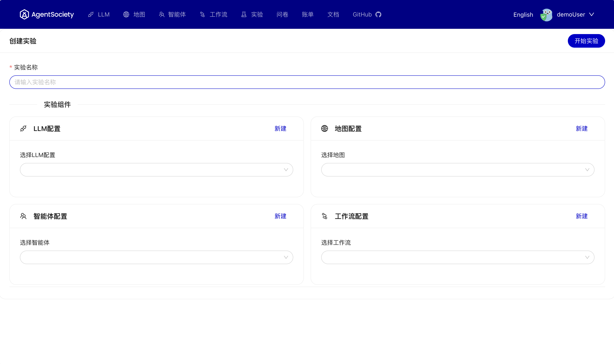

# 在 UI 上创建实验

要通过 Web 界面启动实验，网页上配置的表单会被发送到后端，后端根据表单内容创建容器并启动实验。

实验创建界面如下图所示：

要启动实验，您需要配置以下四个表单：
- LLM配置
- 地图配置
- 智能体配置
- 工作流配置

完成所有四个配置表单的选择后，点击 `开始实验` 按钮来启动您的实验。

要填写配置表单，您可以点击 `创建新配置` 按钮，或者在左上角选择特定的表单按钮来创建新配置。

启动实验后，页面会自动重定向到实验页面，您可以在那里监控实验的运行状态。更多详细信息，请参阅 [UI 主页](./02-ui-introduction.md)。
实验完成后，您可以使用 Goto 按钮查看详细信息和进度。